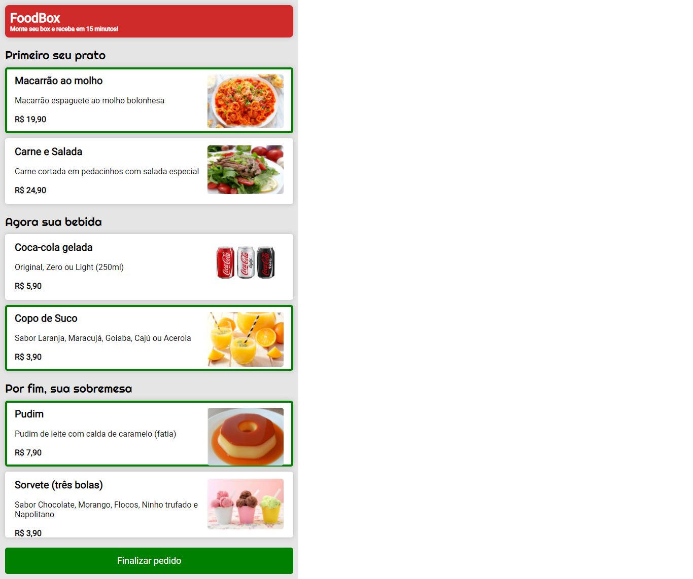
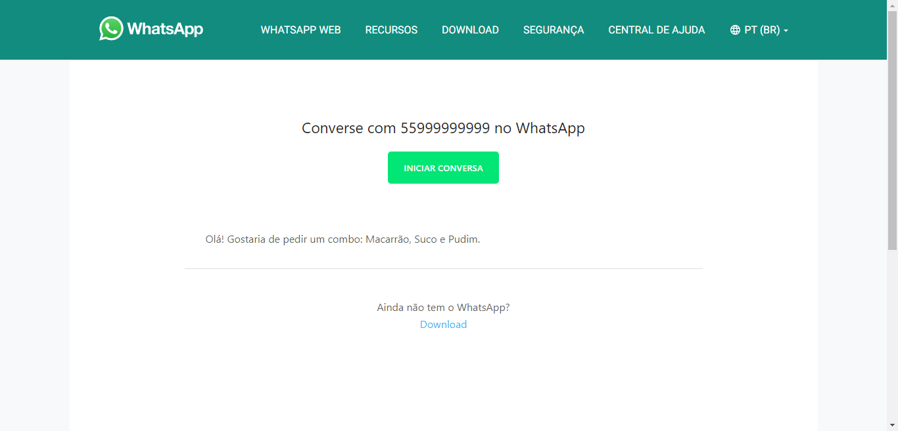

<h1 align="center">
  FoodBox - Minicurso Driven
</h1>

## 📖 Descrição

O projeto foi desenvolvido durante um minicurso ofertado pela Driven. Trata-se de uma aplicação semelhante a um app de delivery onde o usuário escolhe seu pedido e envia pelo WhatsApp a mensagem diretamente ao dono do estabelecimento.

---

## 🚀 Tecnologias

Este projeto foi desenvolvido com as seguintes tecnologias:

- HTML
- CSS
- JavaScript

---

## 🚧 Projeto

<h3><strong>Página Inicial</strong></h3>

 

<h3><strong>Envio do pedido via WhatsApp</strong></h3>

---

## 📝 Licença

Esse projeto está sob a licença MIT. Veja o arquivo [LICENSE](.github/LICENSE) para mais detalhes.

---

Feito com ♥ by Vitoria Nobre